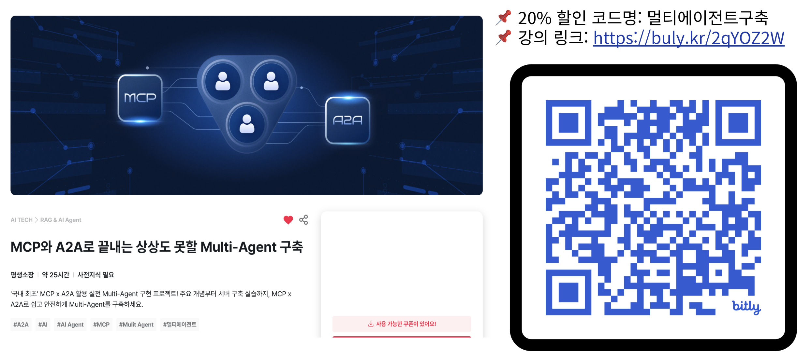
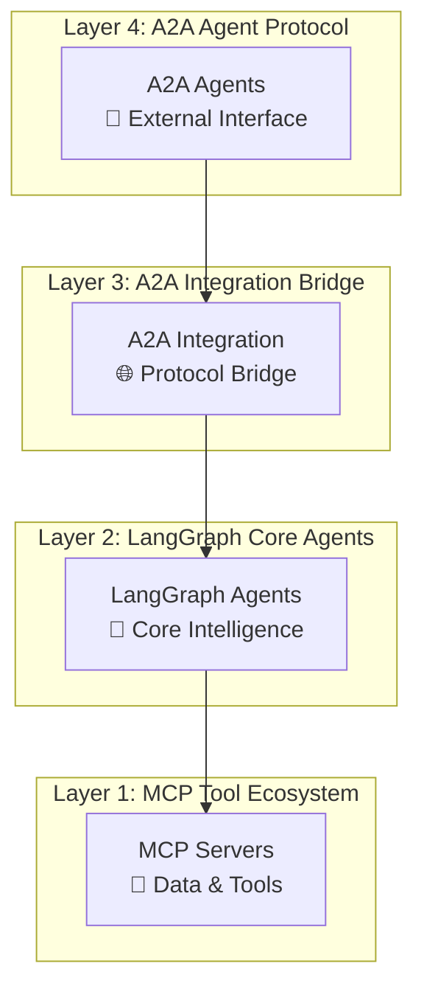
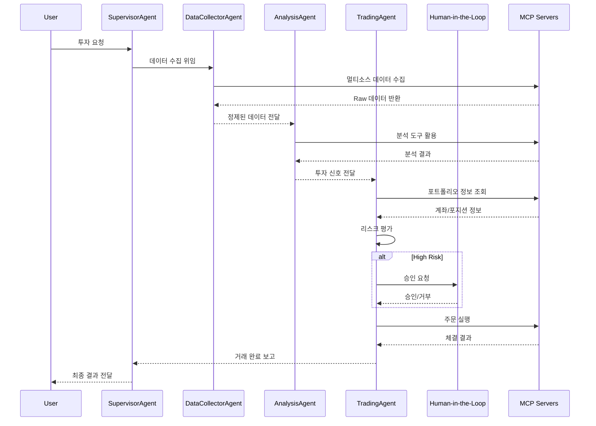

# FastCampus! LangGraph, MCP, A2A 프로토콜 기반 멀티 에이전트 시스템

**완전 자동화된 지능형 주식 투자 시스템**으로,  
실시간 데이터 수집부터 리스크 관리, Human-in-the-Loop 승인까지 전체 투자 프로세스를 통합 관리합니다.

---

  

---

## 주요 구성요소

### 에이전트 구성

#### **SupervisorAgent** - 마스터 오케스트레이터

- **워크플로우**: 오케스트레이터
- **핵심 기능**: 요청 분석, 에이전트 조정, 순차/병렬 실행 전략
- **특징**: LLM 기반 요청 파싱을 통한 하위 에이전트로 작업 전달

#### **DataCollectorAgent** - 통합 데이터 수집

- **워크플로우**: 8-노드 데이터 파이프라인 (수집→검증→통합→품질평가)
- **핵심 기능**: 멀티소스 데이터 수집, 품질 검증, 표준화
- **특징**: 5개 도메인 MCP 서버 통합, 데이터 품질 점수(0.0~1.0) 계산

#### **AnalysisAgent** - 4차원 분석 엔진

- **워크플로우**: 9-노드 분석 파이프라인 (개별분석→통합→권장사항)
- **핵심 기능**: Technical, Fundamental, Macro, Sentiment 통합 분석
- **특징**: 카테고리 기반 신호 시스템, 가중평균 통합, 신뢰도 계산

#### **TradingAgent** - Human-in-the-Loop 거래

- **워크플로우**: 주식 매매 파이프라인 (전략→최적화→리스크→휴먼 승인→실행)
- **핵심 기능**: 전략 수립, 포트폴리오 최적화, VaR 기반 리스크 평가
- **특징**: Human 승인 조건부 라우팅, 실시간 모니터링

### MCP 서버 구성

#### **5개 키움증권 REST API 기반 MCP 서버**

- `market_domain` (Port 8031): 실시간 시세, 차트, 순위, 기술적 지표
- `info_domain` (Port 8032): 종목 정보, ETF, 테마, 기업 정보
- `trading_domain` (Port 8030): 주문 관리, 계좌 정보, 거래 내역, Mock 거래
- `investor_domain` (Port 8033): 기관/외국인 동향, 투자자 행동 분석
- `portfolio_domain` (Port 8034): 자산 관리, VaR 계산, Sharpe ratio, 리스크 메트릭

#### **3개 외부 데이터 수집 & 분석 MCP 서버**

- `financial_analysis_mcp` (Port 8040): 재무 분석, 밸류에이션 도구
- `naver_news_mcp` (Port 8050): 뉴스 수집, 감성 분석
- `tavily_search_mcp` (Port 3020): 웹 검색, 시장 동향 조사

#### **에이전트별 MCP 서버 연결 매핑**

| Agent | Connected MCP Servers | Primary Functions |
|-------|----------------------|------------------|
| **DataCollectorAgent** | market_domain, info_domain, investor_domain, naver_news_mcp, tavily_search_mcp | 멀티소스 데이터 수집, 품질 검증 |
| **AnalysisAgent** | market_domain, info_domain, financial_analysis_mcp, portfolio_domain | 4차원 통합 분석, 신호 생성 |
| **TradingAgent** | trading_domain, portfolio_domain | 주문 실행, 리스크 관리, Human 승인 |
| **SupervisorAgent** | (No direct connections) | 워크플로우 조정, Agent 오케스트레이션 |

### 주식 데이터 분석을 위한 방법론

#### **Technical Analysis (기술적 분석)**

- RSI, MACD, Moving Averages, Volume 지표 통합
- 지지/저항선 자동 계산, 트렌드 방향성 분석
- **출력**: BULLISH|BEARISH|NEUTRAL + STRONG_BUY~STRONG_SELL

#### **Fundamental Analysis (기본적 분석)**

- P/E, P/B, ROE, 부채비율, 수익성 지표 평가
- **출력**: UNDERVALUED|FAIR|OVERVALUED + 투자 신호

#### **Macro Analysis (거시경제 분석)**

- GDP, 인플레이션, 금리, 환율 영향 분석
- **출력**: EXPANSION|STABLE|CONTRACTION + 섹터 추천

#### **Sentiment Analysis (감성 분석)**

- 뉴스 헤드라인/요약 내용 기반 시장 심리 측정
- **출력**: POSITIVE|NEUTRAL|NEGATIVE + 대응 전략

## 🛠️ 기술 스택

### **Backend & AI Framework**

#### **핵심 AI 프레임워크**

- **LangGraph** 0.6.4 - 상태 기반 멀티 에이전트 워크플로우
- **LangChain** 0.3.27 - LLM 통합 및 체인 관리  
- **A2A SDK** 0.3.0 - Agent-to-Agent 통신 프로토콜

#### **MCP 서버 생태계**

- **FastMCP** 2.11.3 - 고성능 MCP 서버 프레임워크
- **langchain-mcp-adapters** 0.1.9 - LangChain-MCP 브리지

#### **데이터 & 분석**

- **pandas** 2.3.1 - 데이터 조작 및 분석
- **finance-datareader** 0.9.96 - 한국 금융 데이터 수집
- **fredapi** 0.5.2 - 미국 연방준비제도 경제 데이터
- **publicdatareader** 1.1.0 - 한국 공공데이터 통합

### **Frontend & 사용자 인터페이스**

#### **Core Framework**

- **Next.js** 15.4.6 - React 기반 풀스택 프레임워크
- **React** 19.1.1 - 최신 React 생태계

#### **AI 대화 인터페이스**

- **@assistant-ui/react** 0.10.42 - AI 어시스턴트 대화 UI
- **@assistant-ui/react-hook-form** 0.10.8 - 폼 통합
- **@assistant-ui/react-markdown** 0.10.9 - 마크다운 렌더링

#### **차트 & 시각화**

- **lightweight-charts** 5.0.8 - TradingView 경량 차트 라이브러리
- **recharts** 3.1.2 - React 차트 라이브러리
- **framer-motion** 12.23.12 - 고급 애니메이션

#### **상태 관리 & 통신**

- **zustand** 5.0.7 - 경량 상태 관리
- **@a2a-js/sdk** 0.3.1 - A2A 클라이언트 SDK

#### **UI 컴포넌트**

- **@radix-ui** - 접근성 최적화 Headless UI 컴포넌트
- **Tailwind CSS** 4.1.12 - 유틸리티 우선 CSS 프레임워크
- **Lucide React** 0.536.0 - 아이콘 라이브러리

### **Frontend 애플리케이션 구조**

#### **핵심 구현 기능**

- **🤖 AI 대화 인터페이스**: assistant-ui 기반 자연어 투자 명령
- **📊 실시간 차트**: TradingView 경량 차트로 시세 시각화
- **💼 포트폴리오 대시보드**: 자산 현황, 수익률, 리스크 지표 통합 뷰
- **🔔 Human-in-the-Loop**: 고위험 거래에 대한 실시간 승인 UI
- **📈 투자 분석 도구**: Technical/Fundamental/Macro/Sentiment 분석 결과 시각화
- **⚡ 실시간 알림**: WebSocket 기반 거래 상태 및 시장 변화 알림

#### **페이지 구성**

```text
frontend/src/app/
├── page.tsx                    # 메인 대시보드
├── trading/                    # 거래 관리 페이지
├── portfolio/                  # 포트폴리오 관리
├── analysis/                   # 투자 분석 도구
├── agents/                     # 에이전트 상태 모니터링
├── test-hitl/                  # Human-in-the-Loop 테스트
└── health/                     # 시스템 상태 확인
```

#### **컴포넌트 아키텍처**

```text
src/components/
├── agents/                     # Agent 상호작용 컴포넌트
├── analysis/                   # 4차원 분석 시각화
├── charts/                     # TradingView & Recharts 통합
├── trading/                    # 주문 및 Human 승인 UI
├── portfolio/                  # 포트폴리오 관리 도구
├── market/                     # 시장 데이터 표시
└── system/                     # 시스템 상태 모니터링
```

### **개발 환경 & 배포**

#### **런타임 & 패키지 관리**

- **Python** 3.12+ - 백엔드 런타임
- **Node.js** 20+ - 프론트엔드 런타임
- **Docker** & **Docker Compose** - 컨테이너화 배포

#### **코드 품질 & 테스팅**

- **Ruff** - Python 린터 및 포매터
- **Jest** & **Testing Library** - React 테스팅
- **TypeScript** 5 - 타입 안전성

### **🎯 Production Ready Status** (2025년 1월 기준)

| Component | Implementation | Documentation | Testing | Status |
|-----------|---------------|---------------|---------|---------|
| **SupervisorAgent** | ✅ Complete | ✅ Ultra-detailed | 🔄 In Progress | 🟢 **Production Ready** |
| **DataCollectorAgent** | ✅ Complete | ✅ Ultra-detailed | 🔄 In Progress | 🟢 **Production Ready** |
| **AnalysisAgent** | ✅ Complete | ✅ Ultra-detailed | 🔄 In Progress | 🟢 **Production Ready** |
| **TradingAgent** | ✅ Complete | ✅ Ultra-detailed | 🔄 In Progress | 🟢 **Production Ready** |
| **MCP Servers** | ✅ Complete | ✅ Complete | 🔄 In Progress | 🟢 **Production Ready** |
| **A2A Integration** | ✅ Complete | ✅ Complete | 🔄 In Progress | 🟢 **Production Ready** |
| **Frontend** | ✅ Complete | ✅ Complete | 🔄 In Progress | 🟢 **Production Ready** |

### **Architecture Diagram**



### **Data Flow & Communication Patterns**



## **코드 참조**

- **[src/code_index.md](src/code_index.md)** - 전체 시스템 아키텍처 및 구조 문서

## **주요 컴포넌트별 참조 정보**

- **[LangGraph 에이전트](src/lg_agents/code_index.md)** - 4개의 Supervisor Pattern 구성의 에이전트
- **[MCP 서버](src/mcp_servers/code_index.md)** - 총 8개의 도메인별 마이크로서비스로 구성된 MCP 서버
- **[A2A 통합 레이어](src/a2a_integration/code_index.md)** - A2A-LangGraph 브리지
- **[A2A 에이전트](src/a2a_agents/code_index.md)** - A2A 프로토콜 래퍼

## 📋 설치 가이드

### 시스템 요구사항

- Python 3.12 이상
- 최신 Update 가 완료된 Docker Desktop (또는 Docker Engine 과 Docker Compose)
- 16GB 이상 RAM 권장
- 30GB 이상 디스크 여유 공간

### Docker 환경

```bash
# 1. 프로젝트 클론
git clone <repository-url>
cd project_1_stock_practice

# 2. API 키 설정 (.env 파일 편집)
cp .env.example .env
vi .env  # 필수 API 키들을 실제 값으로 변경

# 3. 전체 시스템 시작 (프로덕션 모드)
./1-run-all-services.sh

# 4. 전체 시스템 시작 (빌드 포함)
./1-run-all-services.sh build

# 5. 시스템 종료
./2-stop-all-services.sh
```

---

### 환경변수 설정

```bash
# 템플릿 파일 복사
cp .env.example .env

# .env 파일 편집하여 필수 값 설정
```

필수 환경변수:

```env
# LLM API (필수)
OPENAI_API_KEY=your_openai_api_key

# 키움증권 API (필수)
KIWOOM_API_KEY=your_api_key
KIWOOM_SECRET_KEY=your_secret_key
KIWOOM_ACCOUNT_NO=your_account_number

# TAVILY API KEY (필수)
TAVILY_API_KEY=your_tavily_key

# Naver Search API 
NAVER_CLIENT_ID=your_naver_client_id
NAVER_CLIENT_SECRET=your_naver_client_secret

# FRED API
FRED_API_KEY=your_fred_api_key

# DART(금융감독원 전자공시시스템) API
DART_API_KEY=your_dart_api_key
```

---

### Reference

#### A2A (Agent-to-Agent) Protocol

- [a2a-js_0.3.1.txt](docs/a2a-js_0.3.1.txt) - A2A JavaScript 프로토콜 문서
- [a2a-python_0.3.0.txt](docs/a2a-python_0.3.0.txt) - A2A Python 프로토콜 문서
- [a2a-samples_0.3.0.txt](docs/a2a-samples_0.3.0.txt) - A2A 샘플 코드 및 예제

#### LangGraph & LangChain

- [langgraph-llms_0.6.2.txt](docs/langgraph-llms_0.6.2.txt) - LangGraph 0.6.2 LLMs 통합 문서
- [langgraph-llms-full_0.6.2.txt](docs/langgraph-llms-full_0.6.2.txt) - LangGraph 0.6.2 LLMs 완전 가이드
- [langchain-llms.txt](docs/langchain-llms.txt) - LangChain LLMs 통합 문서
- [langchain-mcp-adapters.txt](docs/langchain-mcp-adapters.txt) - LangChain MCP 어댑터 문서

#### MCP (Model Context Protocol)

- [fastmcp_2.11.3_llms-full.txt](docs/fastmcp_2.11.3_llms-full.txt) - FastMCP 2.11.3 완전 가이드
- [prompt-kit-llms-full.txt](docs/prompt-kit-llms-full.txt) - Prompt Kit LLMs 완전 가이드

#### 키움증권 API 문서

- [kiwoom_rest_api_180_docs.md](docs/kiwoom_rest_api_180_docs.md) - 키움증권 REST API 180개 문서
- [kiwoom_rest_api_official_docs.pdf](docs/kiwoom_rest_api_official_docs.pdf) - 키움증권 REST API 공식 문서 (PDF)
- [kiwoom_rest_api_official_docs.xlsx](docs/kiwoom_rest_api_official_docs.xlsx) - 키움증권 REST API 공식 문서 (Excel)

#### Frontend & State Management

- [useful_zustand_docs.txt](docs/useful_zustand_docs.txt) - Zustand 상태 관리 라이브러리 문서
