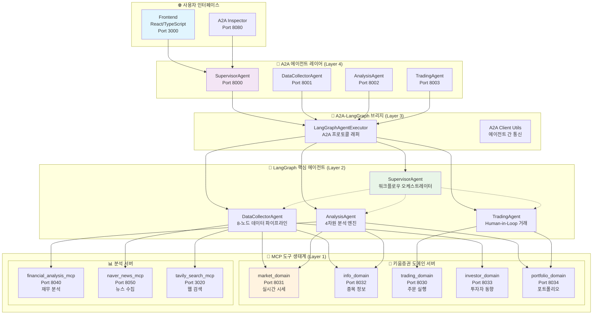
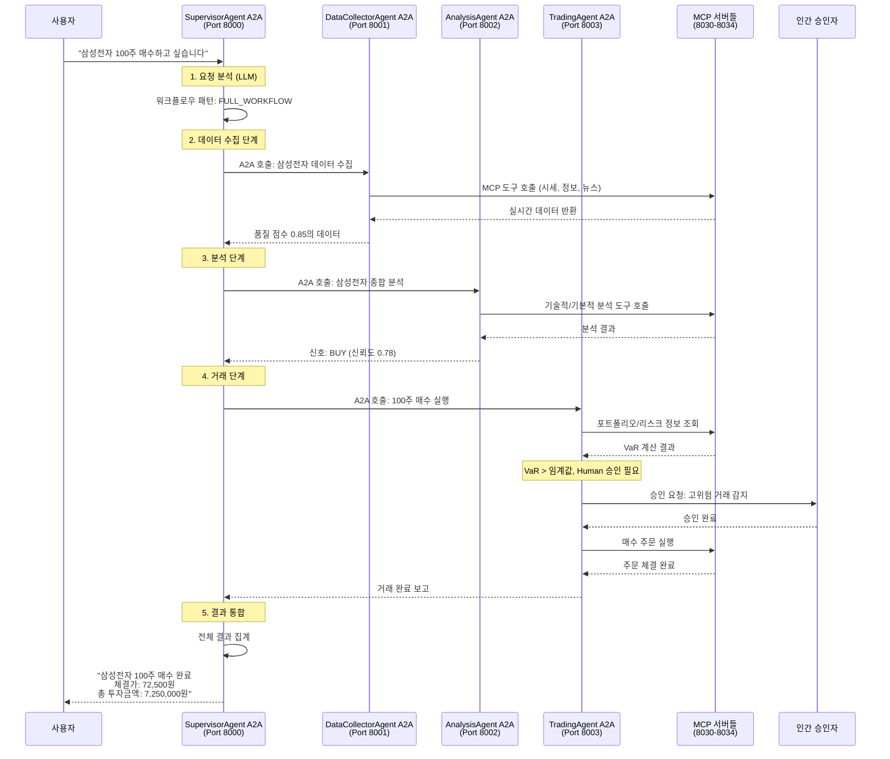

# 전체 코드 분석 보고서: FastCampus MCP & A2A 기반 멀티 에이전트 주식 투자 시스템

## 1. 서론 (Introduction)

이 프로젝트는 LangChain을 알고 있지만 A2A(Agent-to-Agent)와 LangGraph에 익숙하지 않은 분을 위한 **멀티 에이전트 기반 주식 투자 자동화 시스템**입니다. 

### 1.1 핵심 개념 설명

**A2A (Agent-to-Agent) 프로토콜**이란:
- AI 에이전트들이 서로 대화하고 협업할 수 있는 표준 통신 규약
- HTTP 기반으로 에이전트 간 구조화된 메시지 교환
- 마치 사람들이 메신저로 대화하듯, AI 에이전트들이 서로 정보를 주고받는 시스템

**LangGraph**란:
- LangChain의 확장으로, AI 워크플로우를 그래프 형태로 설계하는 프레임워크
- 복잡한 AI 작업을 여러 단계(노드)로 나누어 순차적/조건부로 실행
- 상태 관리와 조건부 라우팅이 가능한 고급 AI 워크플로우 엔진

**MCP (Model Context Protocol)**란:
- AI 모델이 외부 도구와 데이터에 접근할 수 있게 해주는 표준 프로토콜
- 데이터베이스, API, 파일 시스템 등을 AI가 활용할 수 있는 "도구 상자"

## 2. 전체 시스템 아키텍처 (Architecture Overview)



## 3. 본론 (Main Analysis)

### 3.1 4계층 아키텍처 상세 분석

#### 🔧 Layer 1: MCP 서버 생태계 (도구 계층)
MCP 서버는 "AI 에이전트가 사용하는 도구 상자"로 이해할 수 있습니다.

**키움증권 5개 도메인 서버:**
```python
# 예시: 시장 데이터 MCP 서버 (market_domain.py)
@mcp.tool()
async def get_current_price(stock_code: str) -> dict:
    """실시간 주가 조회"""
    # 키움 OpenAPI 호출하여 실시간 주가 반환
    
@mcp.tool() 
async def get_chart_data(stock_code: str, period: str) -> dict:
    """차트 데이터 조회"""
    # 일봉, 주봉, 월봉 차트 데이터 반환
```

**포트 매핑:**
- 8030: 거래 실행 (매수/매도 주문)
- 8031: 시장 데이터 (실시간 시세, 차트)  
- 8032: 종목 정보 (기업 정보, 재무제표)
- 8033: 투자자 동향 (기관/외국인 매매)
- 8034: 포트폴리오 (자산 관리, 리스크 측정)

#### 🤖 Layer 2: LangGraph 핵심 에이전트 (비즈니스 로직)

**SupervisorAgent - 마스터 지휘관:**
```python
class WorkflowPattern(str, Enum):
    DATA_ONLY = "data_only"         # 단순 데이터 조회
    DATA_ANALYSIS = "data_analysis"  # 데이터 + 분석
    FULL_WORKFLOW = "full_workflow" # 전체 플로우 (거래 포함)

# 워크플로우 노드 구조 (10개 노드)
def init_nodes(self, graph: StateGraph):
    graph.add_node("route", self.route_request)           # 요청 분석
    graph.add_node("data_collector", self.call_data_agent) # 데이터 수집
    graph.add_node("analysis", self.call_analysis_agent)   # 분석 수행
    graph.add_node("trading", self.call_trading_agent)     # 거래 실행
    graph.add_node("aggregate", self.aggregate_results)    # 결과 통합
```

**DataCollectorAgent - 데이터 수집 전문가:**
```python
# 8개 노드로 구성된 데이터 파이프라인
def init_nodes(self, graph: StateGraph):
    graph.add_node("collect_market_data", self.collect_market)    # 시장 데이터
    graph.add_node("collect_stock_info", self.collect_info)       # 종목 정보  
    graph.add_node("collect_news", self.collect_news)             # 뉴스 수집
    graph.add_node("validate_data", self.validate_data)           # 데이터 검증
    graph.add_node("integrate_data", self.integrate_data)         # 통합 처리
    # 품질 점수 (0.0~1.0) 계산하여 신뢰도 제공
```

**AnalysisAgent - 4차원 분석 엔진:**
```python
# 9개 노드로 구성된 종합 분석 시스템
def init_nodes(self, graph: StateGraph):
    graph.add_node("technical_analysis", self.technical_analysis)     # 기술적 분석
    graph.add_node("fundamental_analysis", self.fundamental_analysis) # 기본적 분석
    graph.add_node("sentiment_analysis", self.sentiment_analysis)     # 감성 분석
    graph.add_node("macro_analysis", self.macro_analysis)             # 거시경제 분석
    graph.add_node("integrate_analysis", self.integrate_signals)      # 신호 통합
    
    # 카테고리 기반 신호 시스템
    # STRONG_BUY | BUY | HOLD | SELL | STRONG_SELL
```

**TradingAgent - Human-in-the-Loop 거래 관리자:**
```python
# 9개 노드로 구성된 안전한 거래 시스템
def init_nodes(self, graph: StateGraph):
    graph.add_node("strategy_formation", self.form_strategy)      # 전략 수립
    graph.add_node("portfolio_optimization", self.optimize)       # 포트폴리오 최적화
    graph.add_node("risk_assessment", self.assess_risk)           # 리스크 평가
    graph.add_node("human_approval", self.human_approval)         # 인간 승인 (조건부)
    graph.add_node("order_execution", self.execute_order)         # 주문 실행
    
    # VaR (Value at Risk) 기반 리스크 관리
    # Human 승인이 필요한 경우: 고위험 거래, 대규모 포지션 변경
```

#### 🌉 Layer 3: A2A-LangGraph 브리지 (통합 계층)

**LangGraphAgentExecutor - 핵심 브리지:**
```python
class LangGraphAgentExecutor(AgentExecutor):
    """LangGraph StateGraph를 A2A 프로토콜로 래핑"""
    
    async def execute(self, context: RequestContext, event_queue: EventQueue):
        # 1. A2A 요청을 LangGraph 입력으로 변환
        processed_input = await self._process_input(context)
        
        # 2. LangGraph 실행 (스트리밍 또는 동기)
        if self.config.enable_streaming:
            # 실시간 스트리밍으로 진행 상황 전송
            async for event in self.graph.astream_events(processed_input):
                await self._handle_streaming_event(event, event_queue)
        else:
            # 동기 실행
            result = await self.graph.ainvoke(processed_input)
        
        # 3. 결과를 A2A 형식으로 변환하여 전송
        await self._send_result(updater, result, event_queue)
```

#### 📡 Layer 4: A2A 에이전트 (외부 인터페이스)

**A2A 에이전트들:**
```python
# supervisor_agent_a2a.py - SupervisorAgent A2A 래퍼
class SupervisorAgentA2A:
    """SupervisorAgent를 A2A 프로토콜로 노출"""
    
    async def run(self):
        # LangGraph SupervisorAgent 생성
        lg_agent = SupervisorAgent()
        
        # A2A Executor로 래핑
        executor = LangGraphAgentExecutor(
            graph=lg_agent.graph,
            name="supervisor",
            description="Master orchestrator"
        )
        
        # A2A 서버로 실행 (포트 8000)
        app = to_a2a_starlette_server(executor)
        await run_uvicorn(app, host="0.0.0.0", port=8000)
```

### 3.2 실제 워크플로우 시나리오

**시나리오: "삼성전자 100주 매수하고 싶습니다"**



### 3.3 데이터 흐름과 상태 관리

**LangGraph 상태 관리:**
```python
class SupervisorState(BaseGraphState):
    messages: Annotated[list[BaseMessage], add_messages]  # 대화 히스토리
    user_question: str = ""                               # 사용자 질문
    workflow_pattern: Optional[WorkflowPattern] = None    # 선택된 워크플로우
    
    # 하위 에이전트 결과들
    collected_data: Optional[Dict[str, Any]] = None       # 수집된 데이터
    analysis_result: Optional[Dict[str, Any]] = None      # 분석 결과
    trading_result: Optional[Dict[str, Any]] = None       # 거래 결과
    
    final_response: str = ""                              # 최종 응답
    success: bool = False                                 # 성공 여부
```

**A2A 메시지 구조:**
```python
# A2A 요청
{
  "messages": [
    {"role": "user", "content": "삼성전자 분석해줘"}
  ]
}

# A2A 응답 (DataPart + TextPart)
{
  "parts": [
    {
      "text": "삼성전자 분석이 완료되었습니다."
    },
    {
      "data": {
        "success": true,
        "collected_data": {...},
        "analysis_result": {...},
        "recommendations": [...]
      }
    }
  ]
}
```

## 4. 중론 (Detailed Implementation Analysis)

### 4.1 MCP 서버의 도구 시스템

**도구 정의 예시:**
```python
# kiwoom_mcp/domains/trading_domain.py
from fastmcp import FastMCP

mcp = FastMCP("KiwoomTradingDomain")

@mcp.tool()
async def buy_stock(
    stock_code: str,
    quantity: int, 
    price_type: str = "market",
    price: Optional[float] = None
) -> Dict[str, Any]:
    """
    주식 매수 주문 실행
    
    Args:
        stock_code: 종목코드 (예: "005930")
        quantity: 매수 수량
        price_type: 주문 유형 ("market" | "limit")
        price: 지정가 (limit 주문시)
    
    Returns:
        주문 결과 및 체결 정보
    """
    # 키움 OpenAPI를 통한 실제 매수 주문
    result = await kiwoom_client.send_order(
        order_type="buy",
        stock_code=stock_code,
        quantity=quantity,
        price_type=price_type,
        price=price
    )
    
    return {
        "success": result.success,
        "order_id": result.order_id,
        "executed_price": result.executed_price,
        "executed_quantity": result.executed_quantity,
        "message": result.message
    }

@mcp.tool()
async def get_account_balance() -> Dict[str, Any]:
    """계좌 잔고 및 보유 종목 조회"""
    balance = await kiwoom_client.get_account_info()
    return {
        "cash_balance": balance.cash,
        "total_assets": balance.total_value,
        "holdings": balance.holdings
    }
```

### 4.2 LangGraph 에이전트의 노드 구현

**DataCollectorAgent 노드 예시:**
```python
async def collect_market_data(self, state: DataCollectorState) -> DataCollectorState:
    """
    시장 데이터 수집 노드
    
    MCP 도구를 활용하여 실시간 시세, 차트, 거래량 데이터 수집
    """
    try:
        stock_code = state["stock_code"]
        logger.info(f"시장 데이터 수집 시작: {stock_code}")
        
        # MCP 도구 병렬 호출로 성능 최적화
        market_tasks = []
        
        # 1. 실시간 시세 조회
        if "get_current_price" in self.available_tools:
            task = self.tools["get_current_price"].ainvoke({"stock_code": stock_code})
            market_tasks.append(("price", task))
        
        # 2. 차트 데이터 조회 (일봉)
        if "get_chart_data" in self.available_tools:
            task = self.tools["get_chart_data"].ainvoke({
                "stock_code": stock_code, 
                "period": "daily",
                "count": 20
            })
            market_tasks.append(("chart", task))
        
        # 3. 거래량 분석
        if "get_volume_data" in self.available_tools:
            task = self.tools["get_volume_data"].ainvoke({"stock_code": stock_code})
            market_tasks.append(("volume", task))
        
        # 병렬 실행
        market_results = {}
        for name, task in market_tasks:
            try:
                result = await task
                market_results[name] = result
                logger.debug(f"{name} 데이터 수집 완료")
            except Exception as e:
                logger.error(f"{name} 데이터 수집 실패: {e}")
                market_results[name] = {"error": str(e)}
        
        # 데이터 품질 평가
        quality_score = self._calculate_data_quality(market_results)
        
        # 상태 업데이트
        state["market_data"] = market_results
        state["quality_scores"]["market"] = quality_score
        
        logger.info(f"시장 데이터 수집 완료 (품질: {quality_score:.2f})")
        return state
        
    except Exception as e:
        logger.error(f"시장 데이터 수집 중 오류: {e}")
        state["errors"].append(f"시장 데이터 수집 실패: {str(e)}")
        return state

def _calculate_data_quality(self, data_results: Dict[str, Any]) -> float:
    """
    데이터 품질 점수 계산 (0.0 ~ 1.0)
    
    품질 평가 기준:
    - 데이터 완성도 (누락된 필드 비율)
    - 데이터 신선도 (최신성)
    - 오류 발생 비율
    """
    total_sources = len(data_results)
    error_count = sum(1 for result in data_results.values() if "error" in result)
    
    # 기본 점수: 오류가 없는 소스 비율
    base_score = (total_sources - error_count) / total_sources if total_sources > 0 else 0
    
    # 완성도 보너스
    completeness_bonus = 0
    for result in data_results.values():
        if isinstance(result, dict) and "error" not in result:
            # 필수 필드 존재 여부 확인
            required_fields = ["price", "volume", "timestamp"]
            present_fields = sum(1 for field in required_fields if field in result)
            completeness_bonus += present_fields / len(required_fields)
    
    if total_sources > 0:
        completeness_bonus /= total_sources
    
    # 최종 점수 계산
    final_score = (base_score * 0.7) + (completeness_bonus * 0.3)
    return min(max(final_score, 0.0), 1.0)
```

### 4.3 A2A 통신과 스트리밍

**실시간 스트리밍 처리:**
```python
async def execute(self, context: RequestContext, event_queue: EventQueue) -> None:
    """A2A 요청 처리 및 실시간 스트리밍"""
    
    # 스트리밍 모드에서 LangGraph 실행
    async for event in self.graph.astream_events(processed_input):
        event_type = event.get("event", "")
        
        # LLM 토큰 스트리밍 - 실시간 진행상황 전송
        if event_type == "on_llm_stream":
            chunk = event["data"].get("chunk")
            if chunk and hasattr(chunk, "content"):
                content = chunk.content
                if content:
                    # 실시간으로 토큰 전송
                    message = new_agent_text_message(content)
                    await event_queue.enqueue_event(message)
        
        # 노드 완료 시 중간 결과 전송
        elif event_type == "on_chain_end":
            node_name = event.get("name", "")
            if node_name == "collect_market_data":
                # 데이터 수집 완료 알림
                progress_msg = new_agent_text_message("✅ 시장 데이터 수집 완료")
                await event_queue.enqueue_event(progress_msg)
        
        # 최종 완료 시 구조화된 결과 전송
        elif event_type == "on_chain_end" and node_name == "__end__":
            # DataPart로 구조화된 결과 전송
            final_result = self.result_extractor(current_state.values)
            data_part = Part(root=DataPart(data=final_result))
            message = new_agent_parts_message([data_part])
            await event_queue.enqueue_event(message)
            
            await updater.complete()
```

### 4.4 Human-in-the-Loop 구현

**거래 승인 시스템:**
```python
async def human_approval(self, state: TradingState) -> TradingState:
    """
    Human-in-the-Loop 승인 노드
    
    고위험 거래나 대규모 포지션 변경 시 인간의 승인을 요청
    """
    try:
        # 리스크 평가 결과 확인
        risk_level = state.get("risk_assessment", {}).get("risk_level", "MEDIUM")
        investment_amount = state.get("investment_amount", 0)
        
        # 승인 필요 조건 확인
        requires_approval = (
            risk_level in ["HIGH", "VERY_HIGH"] or
            investment_amount > 10000000 or  # 1000만원 초과
            state.get("analysis_confidence", 1.0) < 0.6  # 신뢰도 60% 미만
        )
        
        if requires_approval:
            logger.info("Human 승인 필요한 거래로 판단됨")
            
            # 승인 요청 메시지 생성
            approval_request = {
                "message": "다음 거래에 대한 승인이 필요합니다.",
                "details": {
                    "stock_code": state["stock_code"],
                    "order_type": state["order_type"],
                    "quantity": state["quantity"],
                    "estimated_amount": investment_amount,
                    "risk_level": risk_level,
                    "confidence": state.get("analysis_confidence", 0),
                    "reasons": state.get("risk_factors", [])
                },
                "options": ["승인", "거부", "수량 조정"]
            }
            
            # Human-in-the-Loop 인터럽트 발생
            state["__interrupt__"] = approval_request
            
            # 승인 대기 상태로 설정
            state["approval_status"] = "pending"
            state["human_approval_required"] = True
            
        else:
            logger.info("자동 승인 조건 충족, Human 승인 생략")
            state["approval_status"] = "auto_approved"
            state["human_approval_required"] = False
        
        return state
        
    except Exception as e:
        logger.error(f"Human 승인 처리 중 오류: {e}")
        state["errors"].append(f"승인 처리 실패: {str(e)}")
        state["approval_status"] = "error"
        return state

# 승인 응답 처리
async def process_human_response(self, state: TradingState, human_input: str) -> TradingState:
    """Human 승인 응답 처리"""
    
    response = human_input.lower().strip()
    
    if response in ["승인", "approve", "yes", "y"]:
        state["approval_status"] = "approved"
        state["human_approved"] = True
        logger.info("Human 승인 완료")
        
    elif response in ["거부", "reject", "no", "n"]:
        state["approval_status"] = "rejected" 
        state["human_approved"] = False
        state["final_response"] = "사용자가 거래를 거부했습니다."
        logger.info("Human 거부, 거래 중단")
        
    elif "수량" in response or "조정" in response:
        # 수량 조정 요청 처리
        try:
            # 숫자 추출하여 새로운 수량 설정
            import re
            numbers = re.findall(r'\d+', response)
            if numbers:
                new_quantity = int(numbers[0])
                state["quantity"] = new_quantity
                state["approval_status"] = "quantity_adjusted"
                logger.info(f"수량 조정: {new_quantity}주")
        except:
            state["approval_status"] = "invalid_response"
    
    return state
```

## 5. 결론 (Conclusion)

### 5.1 시스템의 혁신적 특징

**1. 4계층 아키텍처의 장점:**
- **확장성**: 각 계층이 독립적으로 확장 가능
- **재사용성**: MCP 도구들을 다른 에이전트에서도 활용
- **유지보수성**: 계층별 책임 분리로 코드 관리 용이
- **테스트 용이성**: 각 계층을 독립적으로 테스트 가능

**2. A2A 프로토콜의 혁신:**
```python
# 에이전트 간 협업이 HTTP API 호출만큼 간단
async def call_analysis_agent(self, stock_data: dict) -> dict:
    async with A2AClientManagerV2("http://localhost:8002") as client:
        return await client.send_data({
            "stock_code": "005930",
            "collected_data": stock_data
        })
```

**3. LangGraph의 강력함:**
- **상태 관리**: 복잡한 워크플로우의 상태를 자동 추적
- **조건부 라우팅**: 상황에 따른 다양한 실행 경로
- **체크포인팅**: 중단된 작업을 이어서 실행 가능
- **Human-in-the-Loop**: 필요시 인간 개입 자연스럽게 처리

### 5.2 실제 운영 시나리오

**개발자 관점에서 본 장점:**

1. **마이크로서비스 아키텍처**: 각 MCP 서버가 독립적인 서비스
2. **Docker 기반 배포**: 일관된 개발/운영 환경
3. **표준 프로토콜**: A2A와 MCP 표준 준수로 호환성 확보
4. **실시간 모니터링**: A2A Inspector로 에이전트 간 통신 추적

**비즈니스 관점에서 본 가치:**

1. **리스크 관리**: Human-in-the-Loop으로 안전한 자동화
2. **확장성**: 새로운 분석 로직이나 데이터 소스 쉽게 추가
3. **감사 추적**: 모든 의사결정 과정이 로그로 기록
4. **규정 준수**: 금융 규제에 맞는 승인 프로세스

### 5.3 학습 포인트 정리

**LangChain → LangGraph 진화:**
- LangChain: 체인 형태의 순차 처리
- LangGraph: 그래프 형태의 복잡한 워크플로우, 조건부 실행

**A2A 프로토콜 핵심:**
- AI 에이전트들이 HTTP API로 소통
- 표준화된 메시지 형식 (TextPart, DataPart)
- 스트리밍과 실시간 통신 지원

**MCP 프로토콜 핵심:**
- AI가 외부 도구/데이터에 접근하는 표준 방법
- FastMCP로 쉽게 도구 서버 구축
- 도구 레지스트리와 동적 로딩

### 5.4 추천 학습 경로

**초급 (LangChain 경험자):**
1. MCP 서버 하나 직접 만들어보기
2. 간단한 LangGraph 워크플로우 구성
3. A2A 기본 통신 실습

**중급:**
1. 멀티 에이전트 협업 시나리오 설계
2. Human-in-the-Loop 구현
3. 실시간 스트리밍 처리

**고급:**
1. 복잡한 금융 분석 로직 구현
2. 대규모 시스템 아키텍처 설계
3. 성능 최적화와 장애 처리

이 시스템은 단순한 주식 투자 도구를 넘어서, **차세대 AI 에이전트 협업 플랫폼의 청사진**을 제시합니다. A2A와 LangGraph의 조합은 복잡한 비즈니스 프로세스를 AI로 자동화하면서도 안전성과 확장성을 보장하는 혁신적인 접근법입니다.