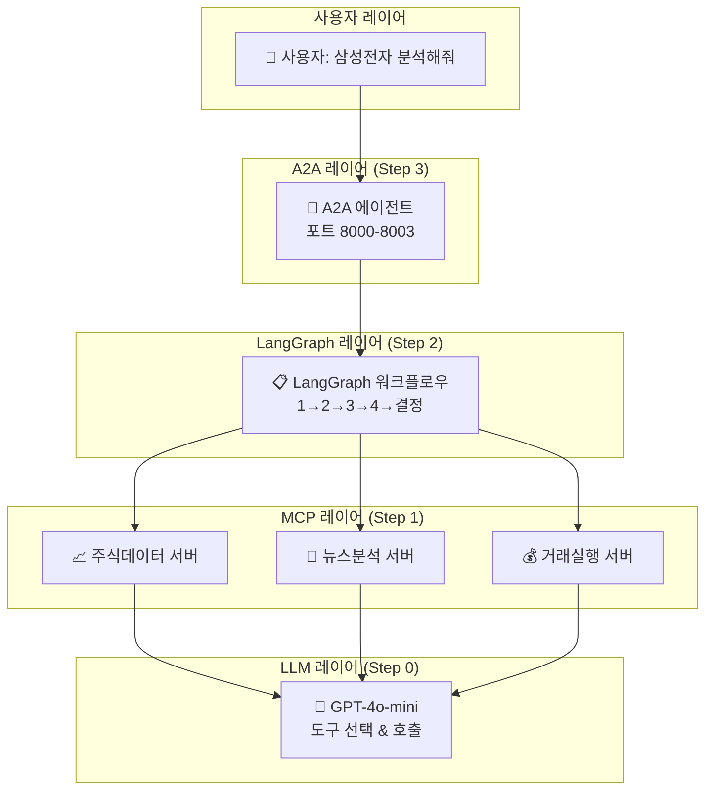

# 🎓 MCP & A2A 완전 정복 가이드북

## 📑 목차
- [Step 0: AI 도구 호출 기초](#step-0-ai-도구-호출-기초)
- [Step 1: MCP 서버 분리](#step-1-mcp-서버-분리)  
- [Step 2: LangGraph 워크플로우](#step-2-langgraph-워크플로우)
- [Step 3: A2A 에이전트 통신](#step-3-a2a-에이전트-통신)
- [Step 4: 전체 시스템 통합](#step-4-전체-시스템-통합)

---

## 🌟 전체 아키텍처 한눈에 보기



---

## Step 0: AI 도구 호출 기초

### 🎯 핵심 개념
**AI가 상황에 맞는 도구를 선택해서 호출하는 원리**

### 📊 동작 과정
```
👤 사용자: "25 + 17을 계산해주세요"
    ↓
🤖 AI 분석: "덧셈이 필요하다"
    ↓  
🔧 도구 선택: add_numbers() 함수
    ↓
📊 실행: add_numbers(25, 17) → 42
    ↓
💬 AI 응답: "계산 결과는 42입니다"
```

### 🔑 핵심 깨달음
- **패턴 인식**: AI는 자연어에서 패턴을 찾아 도구 선택
- **컨텍스트 이해**: 단순한 키워드가 아닌 맥락 파악
- **결과 해석**: 도구 결과를 자연스럽게 설명

### 📁 실습 파일
- `mock_llm_with_tools.py`: API 키 없이도 체험 가능
- `llm_with_tools.py`: 실제 GPT-4o-mini 사용
- `simple_llm_test.py`: 기본 LLM 연결 테스트

---

## Step 1: MCP 서버 분리

### 🎯 핵심 개념
**AI와 도구를 별도 서버로 분리하여 독립적으로 관리**

### 🏗️ 아키텍처 변화
```
Before (Step 0):
┌─────────────────────────────┐
│   하나의 프로그램            │
│   🧠 AI + 🔧 도구           │
└─────────────────────────────┘

After (Step 1):  
┌──────────┐  MCP   ┌──────────┐
│   AI     │ <----> │  도구     │
│ 프로그램  │ 프로토콜 │  서버     │
└──────────┘        └──────────┘
```

### 🌟 MCP 프로토콜의 장점
1. **자동 도구 발견**: AI가 서버의 도구 목록을 자동으로 알 수 있음
2. **표준화**: 모든 MCP 서버가 동일한 방식으로 통신
3. **메타데이터**: 도구 설명, 파라미터 정보를 자동 제공
4. **에러 처리**: 표준화된 에러 응답과 검증

### 📈 실제 활용 예시
```
투자 AI 시스템:
🧠 GPT-4o-mini 
  ↓ MCP 프로토콜
🔧 주식 데이터 서버 (get_price, get_chart)
🔧 뉴스 분석 서버 (search_news, analyze_sentiment)  
🔧 거래 실행 서버 (buy_stock, sell_stock)
```

### 📁 실습 파일
- `simple_calculator_mcp.py`: FastMCP 서버 구현
- `simple_http_server.py`: 일반 HTTP API와 비교용

---

## Step 2: LangGraph 워크플로우

### 🎯 핵심 개념
**복잡한 작업을 체계적인 워크플로우로 처리**

### 🧩 LangGraph 핵심 요소 (ELI5)

#### 1. **그래프 구조** 🕸️
> **5살 아이에게**: "레고 블록을 순서대로 연결하는 것처럼!"

```
실제 예시: 주식 분석 워크플로우

📊 노드1: 주식 가격 조회
    ↓
📈 노드2: 차트 데이터 분석  
    ↓
📰 노드3: 뉴스 수집
    ↓
🤔 노드4: 종합 판단
    ↓
✅ 노드5: 최종 결정
```

#### 2. **상태 관리** 🧠
> **5살 아이에게**: "공부할 때 노트에 중요한 것들을 적어두는 것처럼!"

```python
# LangGraph 상태 예시
state = {
    "stock_symbol": "삼성전자",
    "current_price": 75000,
    "news_sentiment": "긍정적", 
    "chart_trend": "상승",
    "final_decision": "매수"
}
```

#### 3. **조건부 라우팅** 🚦
> **5살 아이에게**: "신호등처럼! 빨간불이면 멈추고, 초록불이면 가는 것처럼!"

```
예시: 주식 가격에 따른 분기

현재_가격 > 목표가 ? 
    ↓ YES → 📈 매도 검토 노드
    ↓ NO  → 📊 추가 분석 노드
```

#### 4. **Human-in-the-Loop** 👤
> **5살 아이에게**: "중요한 결정은 엄마아빠한테 물어보는 것처럼!"

```
AI 판단: "삼성전자 매수 추천"
    ↓
👤 사람 승인: "정말 사도 괜찮을까?" 
    ↓
✅ 확인 후 → 거래 실행
❌ 거부 → 재분석 또는 취소
```

### 🎮 실제 워크플로우 시나리오

```
🎯 미션: "삼성전자 주식 분석 후 투자 결정"

노드1 📊 [주가 조회]
  ├─ Tool: get_stock_price("삼성전자")
  ├─ 결과: 75,000원
  └─ 상태 업데이트: current_price = 75000

노드2 📈 [기술적 분석] 
  ├─ Tool: get_chart_data("삼성전자", "3개월")
  ├─ 분석: 이동평균선, RSI, MACD
  └─ 상태 업데이트: technical_signal = "매수"

노드3 📰 [뉴스 분석]
  ├─ Tool: search_news("삼성전자", "최근 1주일") 
  ├─ Tool: analyze_sentiment(news_data)
  └─ 상태 업데이트: news_sentiment = "중립"

조건부 라우팅 🚦
  technical_signal == "매수" AND news_sentiment != "부정적"
    ↓ YES → 노드4 [매수 검토]
    ↓ NO  → 노드5 [관망 모드]

노드4 👤 [Human-in-Loop]
  ├─ AI 추천: "매수 권장 (신뢰도: 75%)"
  ├─ 사용자 확인 대기...
  └─ 승인 → 노드6 [거래 실행]

노드6 💰 [거래 실행]
  ├─ Tool: buy_stock("삼성전자", quantity=10)
  ├─ 결과: 매수 체결 완료
  └─ 알림: "삼성전자 10주 매수 완료"
```

### 🔥 Step 1과의 차이점

| 구분 | Step 1 (단순 MCP) | Step 2 (LangGraph) |
|------|------------------|-------------------|
| 처리 방식 | 도구 하나씩 호출 | 체계적 워크플로우 |
| 상태 관리 | ❌ 없음 | ✅ 단계별 상태 저장 |
| 조건부 실행 | ❌ 불가능 | ✅ 상황별 분기 |
| 복잡한 로직 | ❌ 어려움 | ✅ 자유자재로 가능 |
| 사람 개입 | ❌ 어려움 | ✅ 자연스럽게 가능 |

---

## Step 3: A2A 에이전트 통신

### 🎯 핵심 개념
**여러 AI 에이전트가 서로 협업하는 분산 시스템**

### 🤝 협업 시나리오
```
🎯 미션: "포트폴리오 전체 최적화"

📊 데이터 수집 에이전트 (포트 8000)
  ├─ 모든 보유 주식 데이터 수집
  └─ 시장 지수, 환율 정보

🔍 분석 전문 에이전트 (포트 8001)  
  ├─ 리스크 분석, 수익률 계산
  └─ 포트폴리오 밸런싱 추천

💰 거래 실행 에이전트 (포트 8002)
  ├─ 매수/매도 주문 처리
  └─ 실시간 체결 모니터링

👨‍💼 감독 에이전트 (포트 8003)
  ├─ 전체 프로세스 조율
  ├─ 사용자 승인 요청 관리
  └─ 최종 결과 리포팅
```

### 🌐 A2A 통신 프로토콜
```
HTTP REST API + 실시간 스트리밍

GET  /status     - 에이전트 상태 조회
POST /execute    - 작업 요청  
POST /collaborate - 다른 에이전트와 협업
WebSocket /stream - 실시간 결과 스트리밍
```

---

## Step 4: 전체 시스템 통합

### 🎯 최종 목표
**실제 주식 투자에 사용할 수 있는 완전한 시스템**

### 🏗️ 전체 아키텍처
```
                🌐 사용자 인터페이스
                       ↓
            📡 A2A 에이전트 레이어 (분산 처리)
          ┌─────────┬─────────┬─────────┬─────────┐
          │ 데이터   │ 분석    │ 거래    │ 감독    │
          │ 수집     │ 전문    │ 실행    │ 관리    │
          └─────────┴─────────┴─────────┴─────────┘
                       ↓
            📋 LangGraph 워크플로우 레이어
          ┌─────────────────────────────────────────┐
          │  복잡한 투자 의사결정 프로세스 관리        │
          └─────────────────────────────────────────┘
                       ↓
              🔧 MCP 도구 서버 레이어  
          ┌─────────┬─────────┬─────────┬─────────┐
          │ 키움증권 │ 뉴스분석 │ 재무분석 │ 웹검색  │
          │ API     │ 서버    │ 서버    │ 서버    │
          └─────────┴─────────┴─────────┴─────────┘
                       ↓
                🧠 GPT-4o-mini (도구 호출)
```

### 💼 실제 사용 시나리오
```
1. 사용자: "오늘 투자 추천해줘"

2. A2A 감독 에이전트: 
   - 데이터 수집 에이전트에게 시장 현황 요청
   - 분석 에이전트에게 포트폴리오 검토 요청

3. LangGraph 워크플로우:
   - 30개 노드로 구성된 복합 분석 프로세스
   - Human-in-Loop으로 중요 결정 확인

4. MCP 도구 서버:
   - 키움증권에서 실시간 데이터 수집
   - 네이버 뉴스에서 시장 심리 분석
   - Tavily로 글로벌 경제 동향 검색

5. 최종 결과:
   "현재 시장 상황을 고려할 때, 
    삼성전자 10주 매수를 권장합니다.
    신뢰도: 78%, 예상 수익률: 12%"
```

---

## 🎯 학습 로드맵

### ✅ 지금까지 완료한 것
- **Step 0**: AI 도구 호출 원리 이해
- **Step 1**: MCP 서버 분리 개념 이해

### 🔜 앞으로 할 것  
- **Step 2**: LangGraph 워크플로우 구현
- **Step 3**: A2A 에이전트 통신 구현
- **Step 4**: 전체 시스템 통합 및 테스트

---

## 🚀 빠른 시작 가이드

### 환경 설정
```bash
# 1. .env 파일 설정
cp learning_examples/.env.example learning_examples/.env
# 실제 OpenAI API 키로 수정

# 2. Step 0 체험 (API 키 불필요)
python learning_examples/step0_llm_basics/mock_llm_with_tools.py

# 3. Step 1 MCP 서버 실행
python learning_examples/step1_basic_mcp/simple_calculator_mcp.py
```

### 주요 명령어
```bash
# 환경 설정 확인
python learning_examples/common_utils.py

# 실제 GPT 테스트 (API 키 필요)
python learning_examples/step0_llm_basics/llm_with_tools.py

# HTTP vs MCP 비교
python learning_examples/step1_basic_mcp/simple_http_server.py
```

---

## 🔗 유용한 링크

- **FastMCP 공식 문서**: https://gofastmcp.com
- **OpenAI Function Calling**: https://platform.openai.com/docs/guides/function-calling
- **LangGraph 문서**: https://langchain-ai.github.io/langgraph/

---

## 💡 FAQ

**Q: MCP와 일반 API의 차이가 뭔가요?**
A: MCP는 AI가 도구를 자동으로 발견하고 호출할 수 있는 표준 프로토콜입니다. 일반 API는 미리 정해진 엔드포인트를 호출하지만, MCP는 AI가 상황에 맞는 도구를 스스로 선택할 수 있어요.

**Q: 실제 돈으로 거래해도 안전한가요?**  
A: Human-in-the-Loop 기능으로 모든 중요한 거래는 사람이 최종 승인해야 합니다. 또한 테스트 모드로 충분히 검증한 후 실제 투자에 사용하세요.

**Q: OpenAI API 비용이 얼마나 드나요?**
A: GPT-4o-mini는 매우 저렴합니다 (입력 1K 토큰당 $0.15). 하루 종일 사용해도 보통 $1-5 정도입니다.

---

*이 가이드북은 계속 업데이트됩니다. 질문이 있으시면 언제든 말씀해 주세요! 🤗*