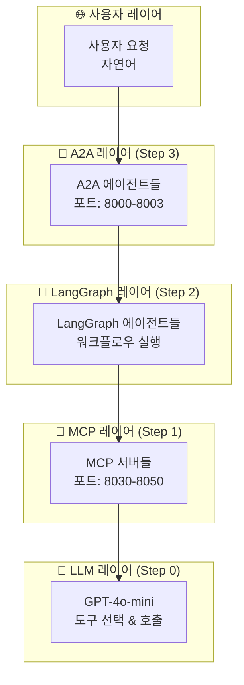

# 🎓 FastCampus MCP & A2A 학습 가이드

## 📚 학습 순서

이 프로젝트는 **4계층 아키텍처**로 구성된 멀티 에이전트 주식 투자 시스템입니다. 차근차근 단계별로 학습해보세요!

### Step 0: LLM 기본 이해 ✅
**위치**: `learning_examples/step0_llm_basics/`

**학습 내용**:
- AI가 도구를 호출하는 기본 개념
- OpenAI Function Calling 체험
- MCP의 핵심 아이디어 이해

**실행**:
```bash
# API 키 없이도 MCP 개념 체험 가능
python learning_examples/step0_llm_basics/mock_llm_with_tools.py
```

**핵심 깨달음**: 
```
사용자: "25 + 17을 계산해주세요"
    ↓ AI 분석
AI: add_numbers 도구 선택
    ↓ 도구 호출
결과: {"result": 42, "message": "25 + 17 = 42"}
    ↓ 자연어 설명
AI: "계산 결과는 42입니다"
```

---

### Step 1: MCP 서버 기초 🚧
**위치**: `learning_examples/step1_basic_mcp/`

**학습 내용**:
- MCP 서버 만들기 (FastMCP 사용)
- AI와 도구 서버 분리하기
- HTTP API vs MCP 프로토콜 차이점

**목표**: Step0의 도구들을 독립적인 서버로 분리

---

### Step 2: LangGraph 워크플로우 📋
**위치**: `learning_examples/step2_langgraph_basics/`

**학습 내용**:
- 상태 관리와 노드 기반 실행
- 조건부 라우팅
- 복잡한 비즈니스 로직 구현

**목표**: 단순한 도구 호출을 체계적인 워크플로우로 발전

---

### Step 3: A2A 에이전트 통신 🤝
**위치**: `learning_examples/step3_a2a_communication/`

**학습 내용**:
- 에이전트 간 메시지 전달
- 분산 시스템 아키텍처
- 실시간 스트리밍

**목표**: 여러 AI 에이전트가 협업하는 시스템

---

### Step 4: 전체 통합 🏗️
**위치**: `learning_examples/step4_full_integration/`

**학습 내용**:
- 4계층 전체 시스템 구동
- 실제 주식 데이터 활용
- Human-in-the-Loop 거래 승인

**목표**: 완성된 멀티 에이전트 투자 시스템

---

## 🏗️ 시스템 아키텍처



## 📖 실제 프로젝트 예제들

### 기존 예제 활용하기
```bash
# 전체 서비스 실행 (MCP 서버들)
./1-run-all-services.sh

# LangGraph 분석 에이전트 직접 호출
python examples/analysis/langgraph_example.py

# A2A 통신 테스트  
python examples/supervisor/a2a_example.py
```

### 주요 구성 요소

**MCP 서버들** (`src/mcp_servers/`):
- `kiwoom_mcp/`: 키움증권 API 연동 (5개 도메인)
- `financial_analysis_mcp/`: 재무 분석 도구
- `naver_news_mcp/`: 뉴스 수집 도구
- `tavily_search_mcp/`: 웹 검색 도구

**LangGraph 에이전트들** (`src/lg_agents/`):
- `supervisor_agent.py`: 마스터 오케스트레이터
- `data_collector_agent.py`: 8노드 데이터 파이프라인
- `analysis_agent.py`: 4차원 분석 엔진
- `trading_agent.py`: Human-in-Loop 거래 관리

**A2A 인터페이스** (`src/a2a_agents/`):
- HTTP API로 LangGraph 에이전트들을 노출
- 실시간 스트리밍과 이벤트 전달
- 분산 시스템 간 표준 통신

## 🎯 학습 목표별 가이드

### 🔰 초급자 (LangChain 경험자)
1. **Step 0 완주**: MCP 개념 완전 이해
2. **Step 1**: 간단한 MCP 서버 직접 구현
3. **기존 예제 실행**: `examples/analysis/langgraph_example.py`

### 🔥 중급자
1. **Step 2**: LangGraph 워크플로우 커스터마이징
2. **Step 3**: A2A 통신으로 에이전트 간 협업
3. **커스텀 MCP 서버**: 새로운 도구 추가

### 🚀 고급자
1. **Step 4**: 전체 시스템 아키텍처 분석
2. **성능 최적화**: 병렬 처리와 캐싱
3. **확장**: 새로운 투자 전략과 도구 통합

## 💡 핵심 학습 포인트

### MCP (Model Context Protocol)
- **목적**: AI가 외부 도구에 접근하는 표준 방법
- **비유**: "AI용 USB 포트" - 어떤 도구든 연결 가능
- **장점**: 도구와 AI 로직의 완전한 분리

### LangGraph
- **목적**: 복잡한 AI 워크플로우를 그래프로 설계
- **비유**: "AI용 워크플로우 엔진" - 조건부 실행과 상태 관리
- **장점**: 체크포인팅, Human-in-Loop, 복잡한 라우팅

### A2A (Agent-to-Agent)
- **목적**: AI 에이전트들이 서로 통신하는 표준
- **비유**: "AI용 REST API" - 구조화된 메시지 교환
- **장점**: 분산 처리, 확장성, 실시간 협업

## 🔧 환경 설정 (중요!)

### .env 파일 설정
```bash
# 1. .env.example을 .env로 복사
cp learning_examples/.env.example learning_examples/.env

# 2. 실제 API 키로 수정
# learning_examples/.env 파일을 열어서:
# OPENAI_API_KEY=your-real-openai-api-key-here
```

### 환경변수 특징
- ✅ **자동 로딩**: 모든 예제가 자동으로 .env 파일에서 로딩
- 🔒 **안전한 표시**: API 키는 마스킹되어 표시 (sk-JcsNm...0NnW)
- ⚙️ **설정 관리**: API 지연, 포트 설정 등 학습용 설정 포함

## 🚧 다음 할 일

### ✅ 완료한 단계
- **Step 0**: LLM + 도구 호출 기본 개념 (**완료**)
- **환경 설정**: .env 파일 기반 API 키 관리 (**완료**)

### 🔄 진행 단계
```bash
# Step 1: MCP 서버 구현하기
cd learning_examples/step1_basic_mcp
# (진행 중 - 함께 완성해봅시다!)

# 환경 설정 테스트
python ../common_utils.py
```

### 🚀 실제 시스템 체험
```bash
# 전체 서비스 실행 (MCP 서버들)
./1-run-all-services.sh

# LangGraph 분석 에이전트 직접 호출
python examples/analysis/langgraph_example.py
```

질문이 있으시면 언제든 말씀해주세요! 🤗